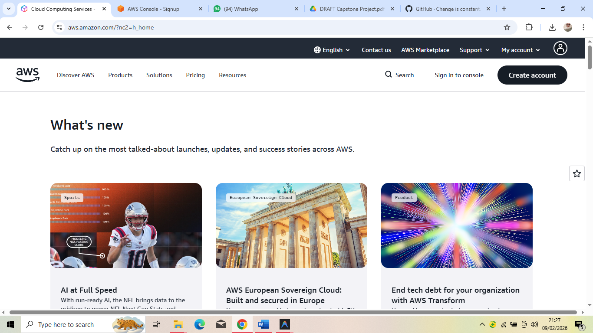
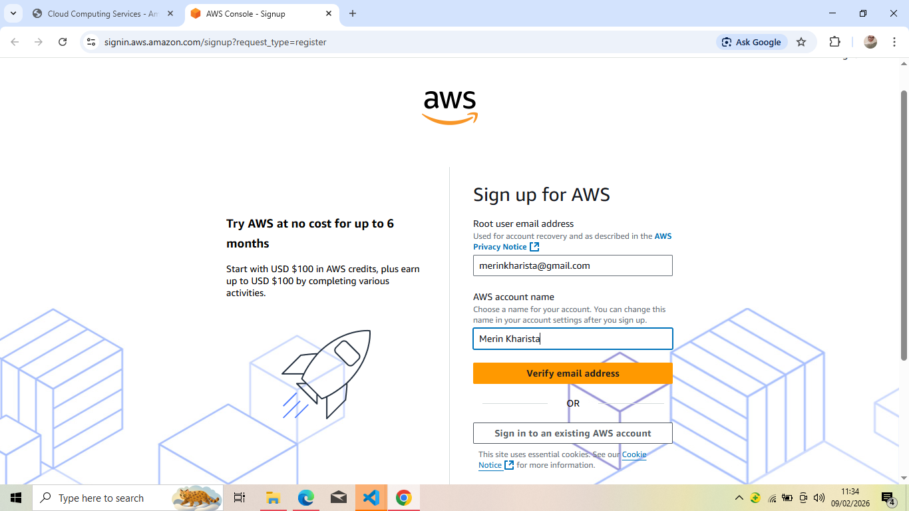
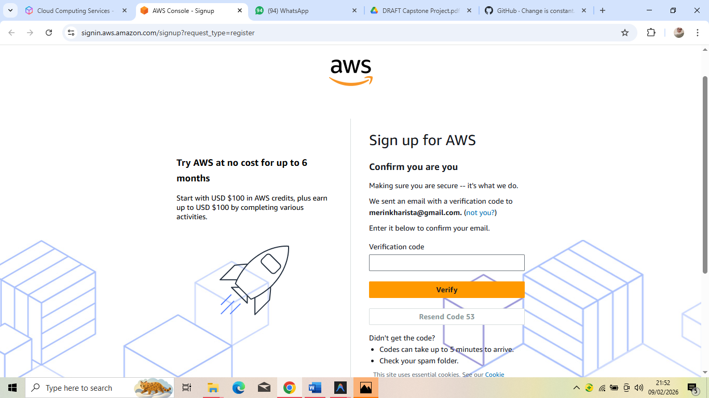
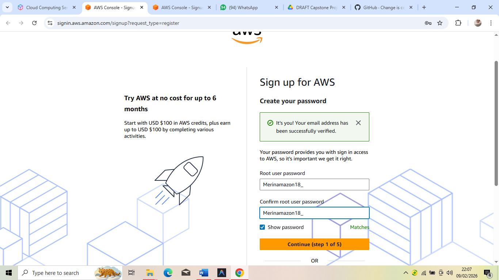
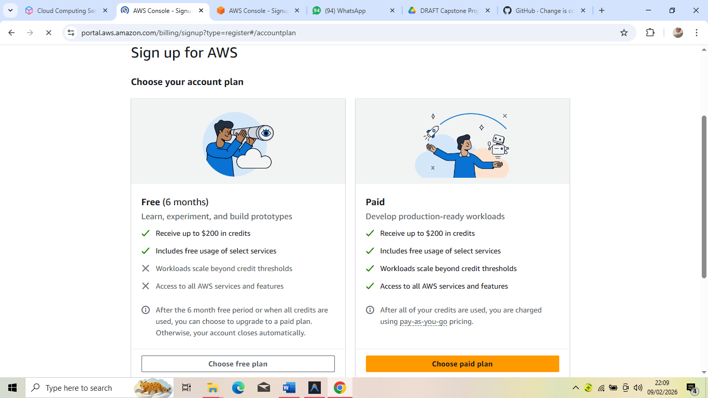
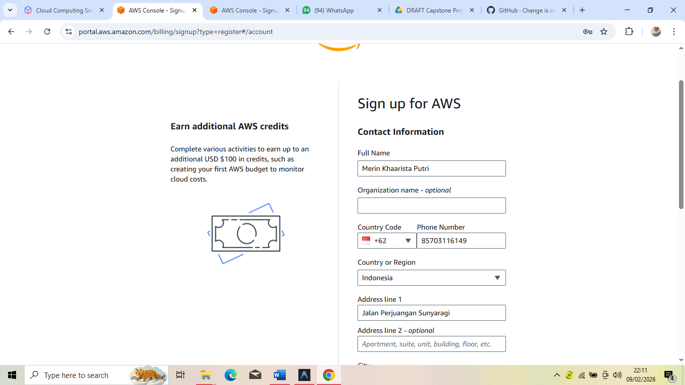
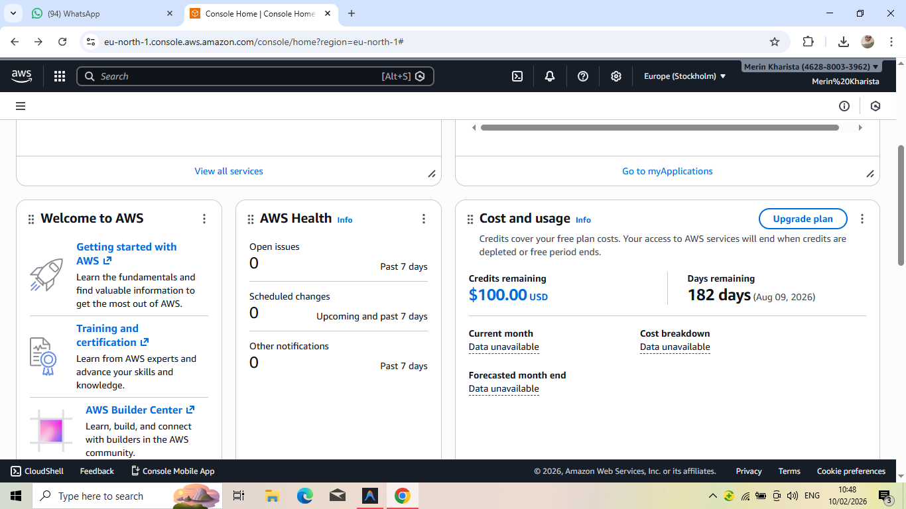

1. Buka laman resmi AWS https://aws.amazon.com/

2. Pilih menu create akun, masukan email & nama akun

3. Verify email address yang dikirim ke alamat email daftar

4. Buat password

5. Pilih free trial

6. Mengisi personal information

7. Isi informasi CC Card

8. Konfirmasi tagihan

9. Tanda berhasil

