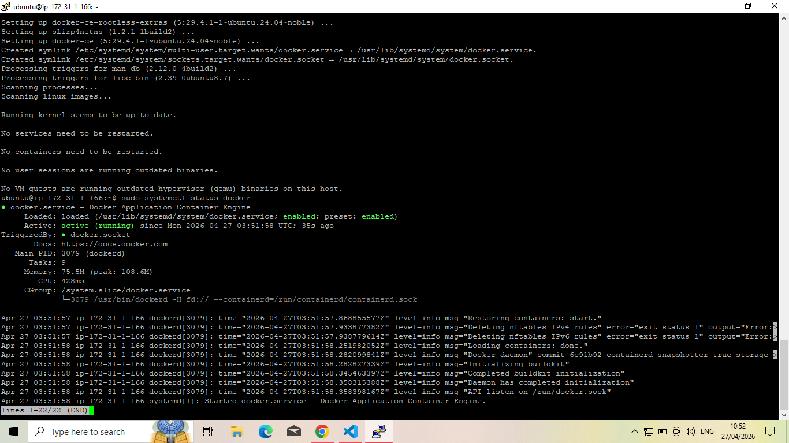
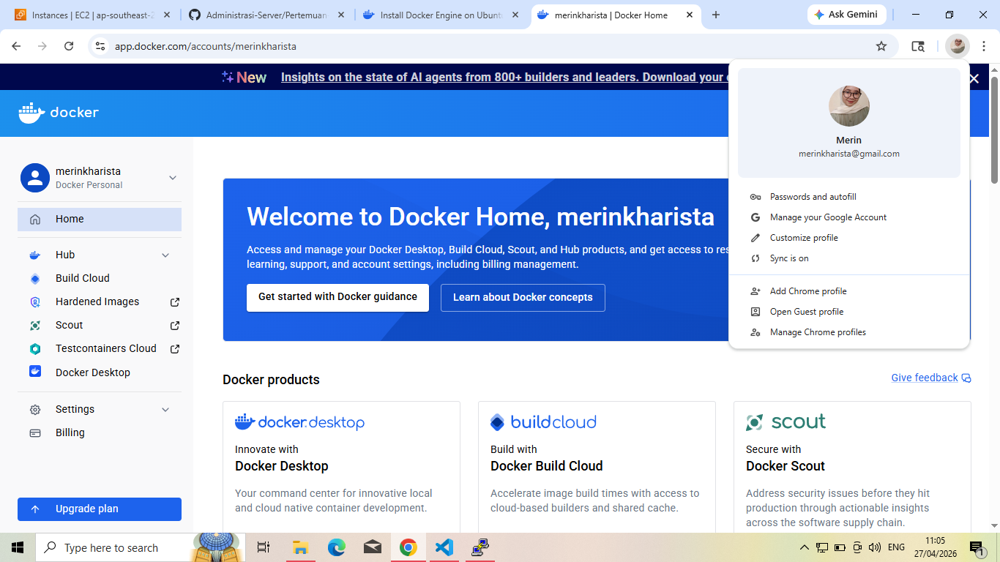
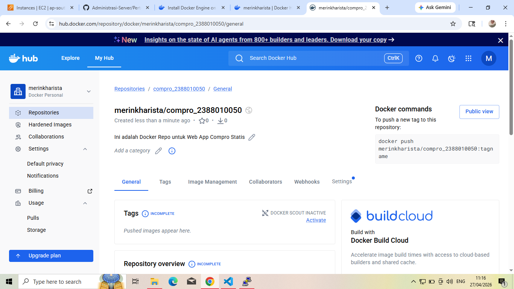
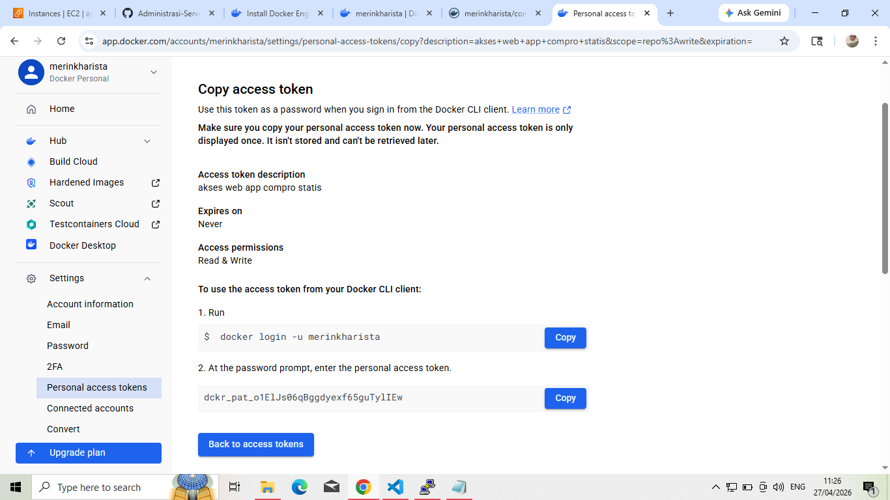
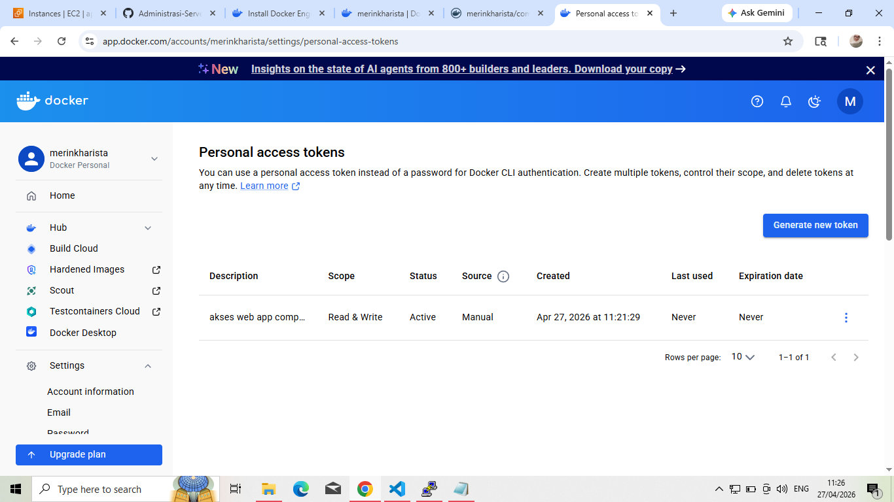
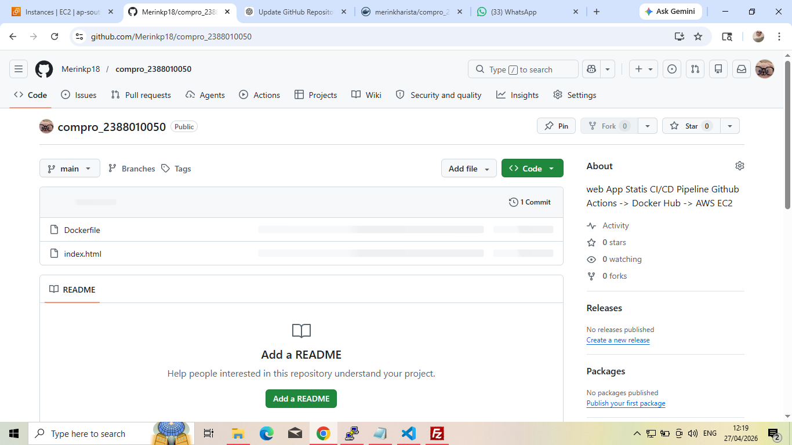

# Intro Docker Engine in Instance EC2 AWS

1. Install based Docker Documentation (https://docs.docker.com/engine/install/ubuntu/)
    - Uninstall old version docker
    sudo apt remove $(dpkg --get-selections docker.io docker-compose docker-compose-v2 docker-doc podman-docker containerd runc | cut -f1)
    - Install Docker
    1. sudo apt-get update && sudo apt-get upgrade
    2. 
    3. Add Docker Repository to APT
    Types: deb
    URIs: https://download.docker.com/linux/ubuntu
    Suites: $(. /etc/os-release && echo "${UBUNTU_CODENAME:-$VERSION_CODENAME}")
    Components: stable
    Architectures: $(dpkg --print-architecture)
    Signed-By: /etc/apt/keyrings/docker.asc
    EOF
    4. Update OS -> sudo apt update
    5. Install Docker Engine -> sudo apt install docker-ce docker-ce-cli containerd.io docker-buildx-plugin docker-compose-plugin
    6. cek installation -> sudo systemctl status docker 
    

2. Registrasi Docker Hub
    - URL Docker Hub -> https://hub.docker.com/repository/docker/merinkharista/compro_2388010050/general
    - Continue with Github
    - Login
    

3. Create Repository for Docker
    - Klik menu -> Hub -> Repositories
    - Klik button new repositories
    - Isi nama repository = compro_2388010050 dan deskripsi = Ini adalah Docker Repo untuk Web App Compro Statis
    - Visibility = public
    - Klik create
    

4. Create token access
    - Klik Profile -> Settings -> personal access tokens
    - Klik Generate New Token
    - Ini Deskripsi
    - Expire Date = none
    - Access Permissions = read/write
    - Klik Generate
    
    

5. Create Projek di Local
    - Buat folder compro_2388010050
    - Masukkan file index.html compro
    - Buat file Dockerfile dengan isi sebagai berikut
    FROM nginx:alpine
    COPY index.html /user/share/mginx/html
    EXPOSE 80

6. Push Projek ke github

