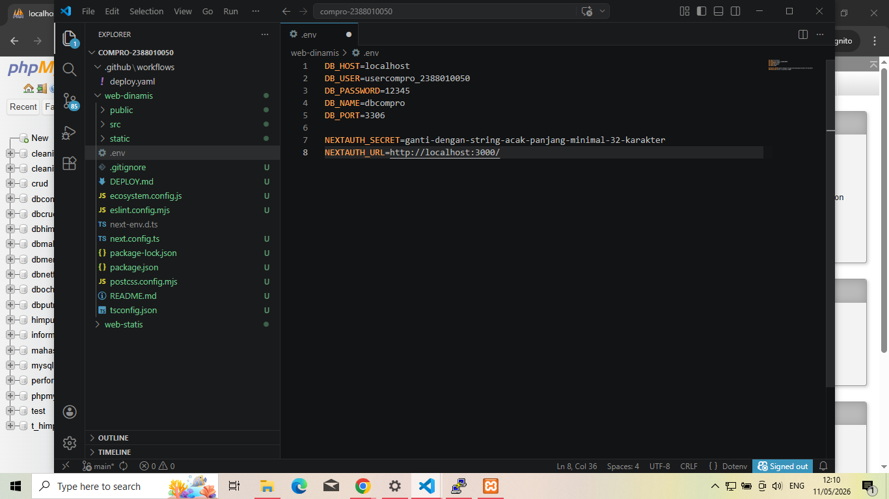
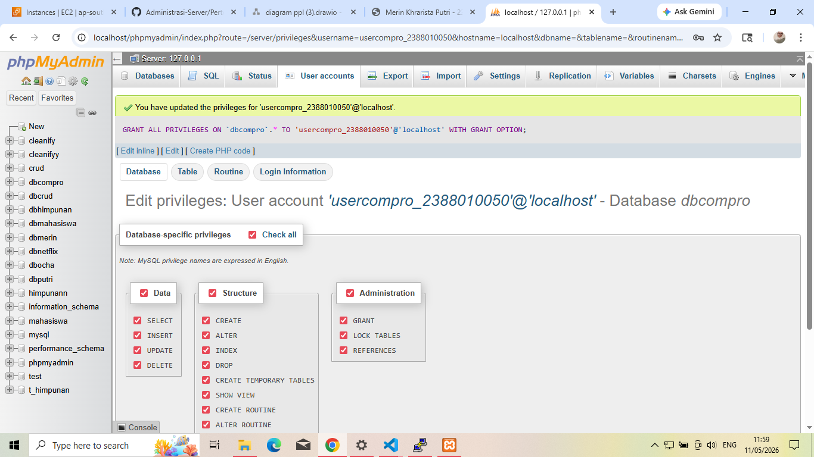
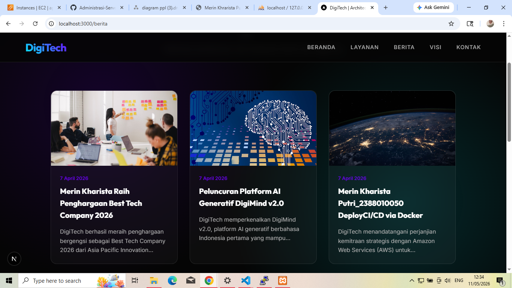

# Deploy Multi Apps CI/CD Docker

1. Start instance di AWS EC2
2. Patching OS -> sudo apt-get update && sudo apt-get upgrade
3. Hapus layanan nginx dan uninstall -> sudo systemctl stop nginx && sudo systemctl disable nginx
    sudo apt remove nginx nginx-common nginx-core
4. Hapus layanan Mariadb dan uninstall -> sudo systemctl stop mariadb && sudo systemctl disable mariadb
    sudo apt remove mariad-server mariadb-client mariadb-common
5. Testing Next.js + db local menggunakan user bukan root pada local environment
    - Copy Project Digitech pada pertemuan-6 kecuali 

    - Buat usercompro_2388010050 set jadi localhost pw = 12345
    
    - Sesuaikan isi file .env di folder compro_2388010050 username sama pw databasenya
    - Open terminal cd web-dinamis
    - npm i
    - npm run dev
    