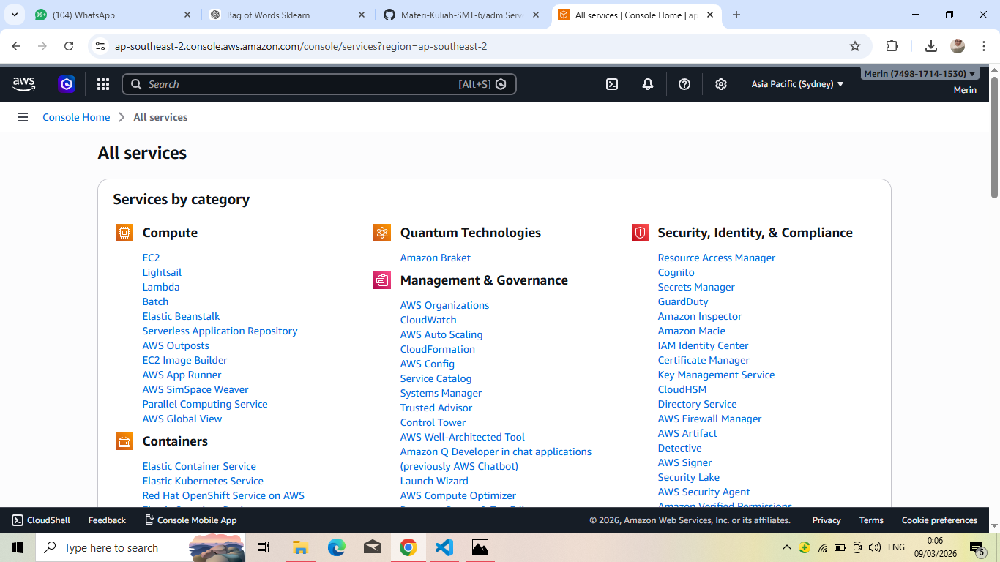
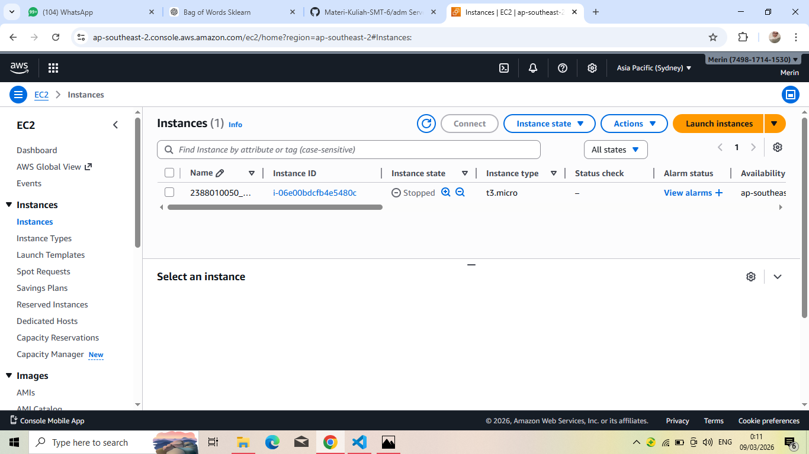
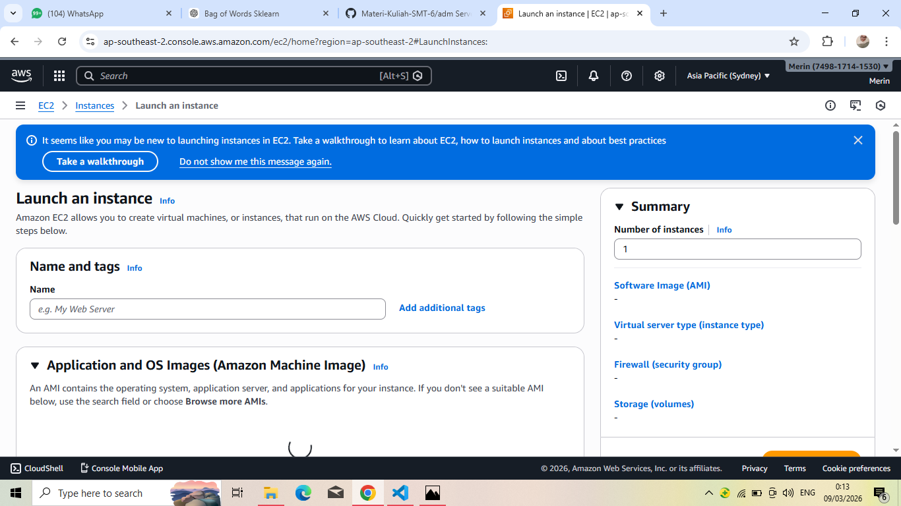
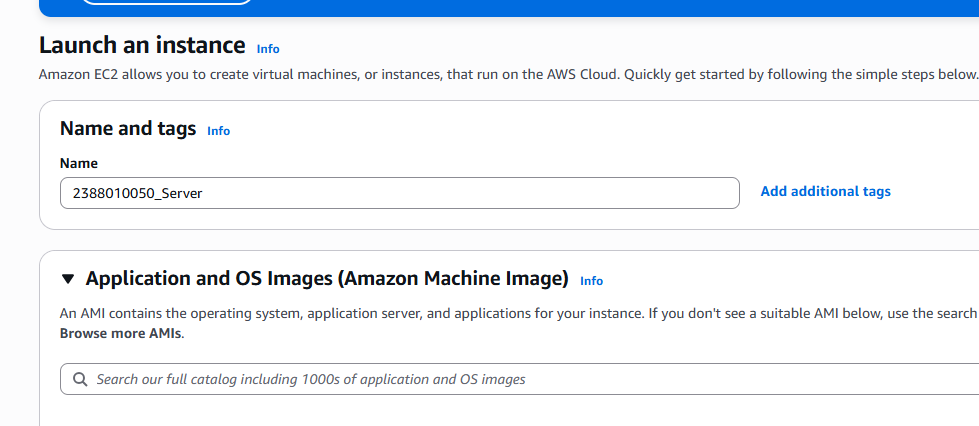
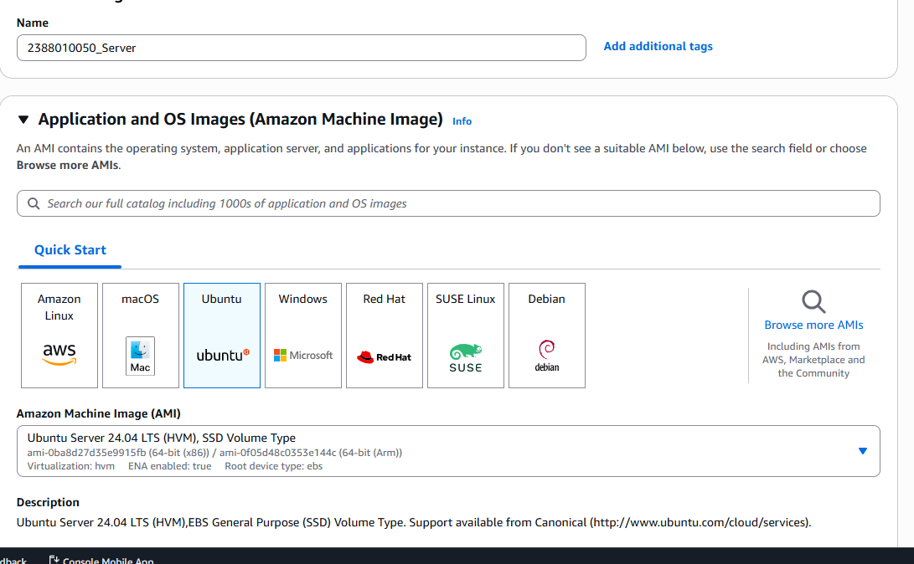
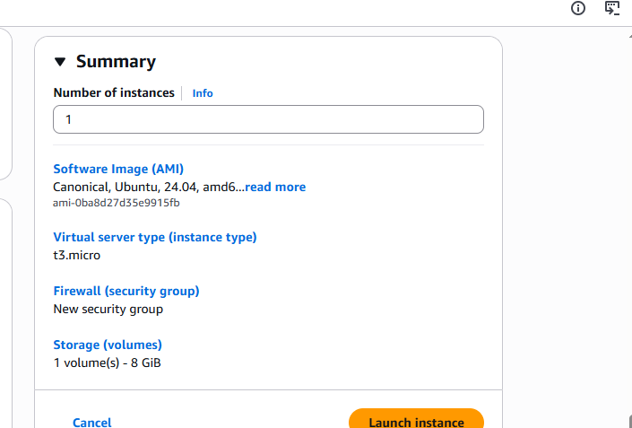
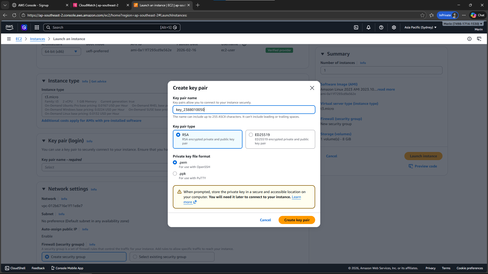
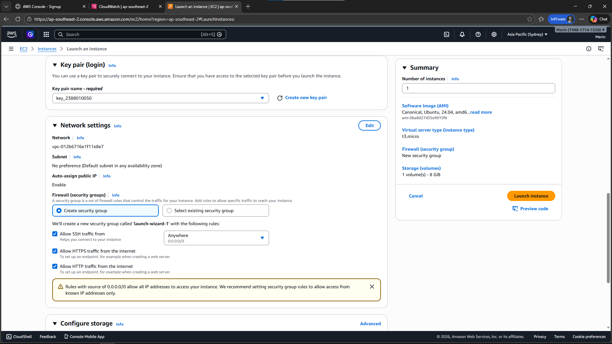
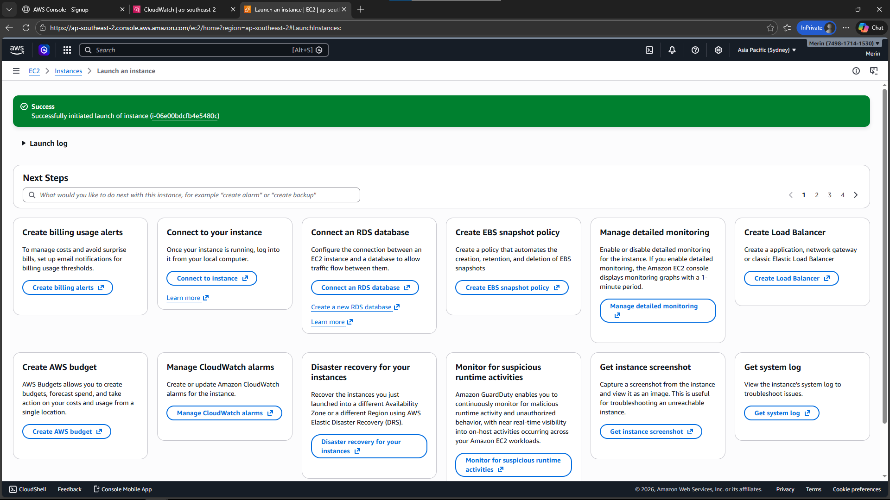

1. Pilih Menu All Services -> EC2

2. Di dalam Menu EC2 kita pilih instance

3. Di dalam Menu Instance pilih launch Instance

4. Beri nama Instance kita dengan format NIM_Server

5. Pilih OS Server untuk instance

6. Pilih Resource instance T3.Micro

7. Membuat Key Pair, Pilih New Key Pair, isi nama Key, pilih RSA, format file .pem, create

8. Setting Kebijakan keamanan / security group
    -Allow SSH
    -Allow HTTPS
    -Allow HTTP

9. Selesai Set-Up Pilih Launch Instance dan sukes launch instance sukses
