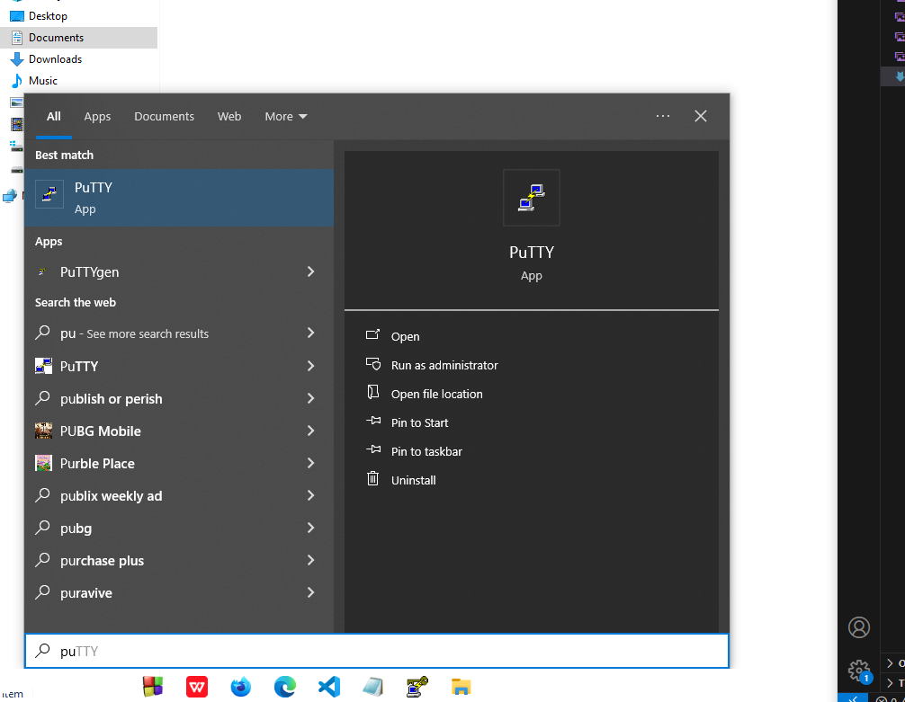
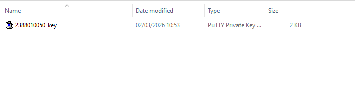
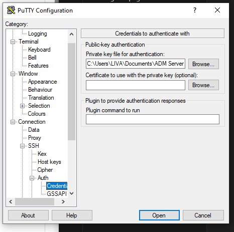
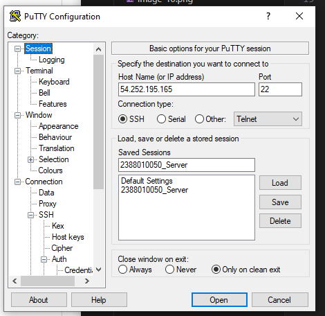
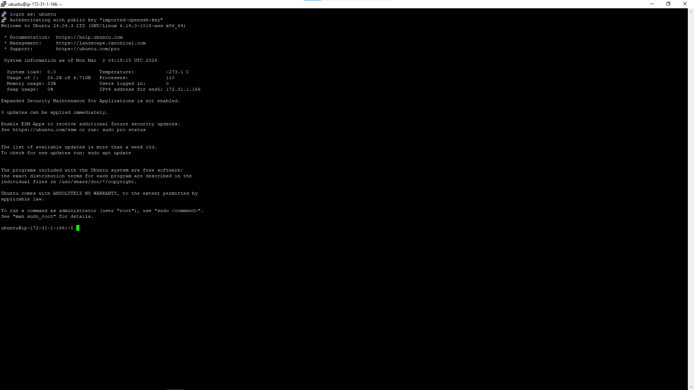
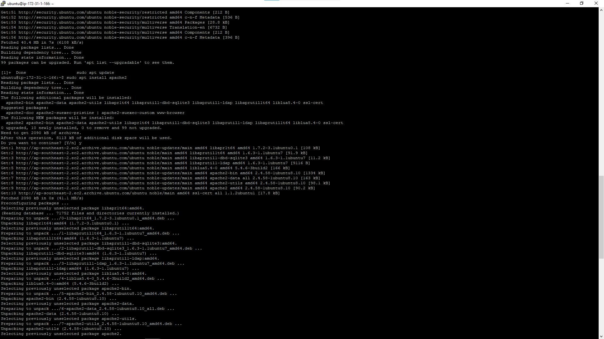
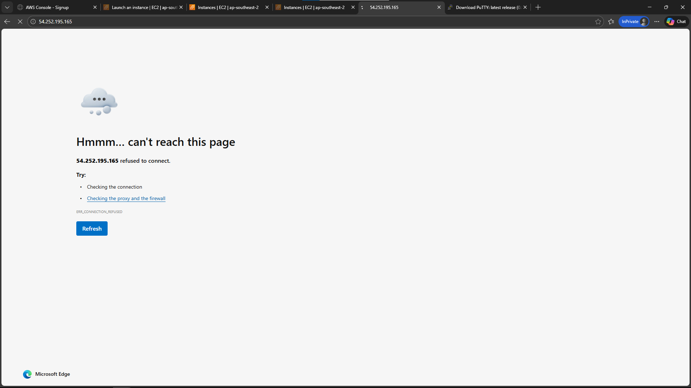
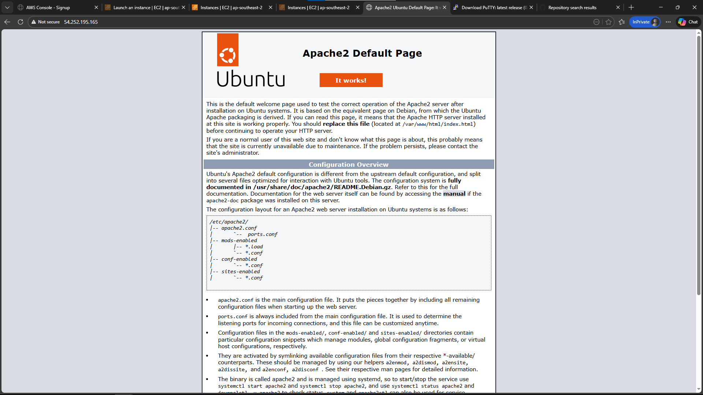
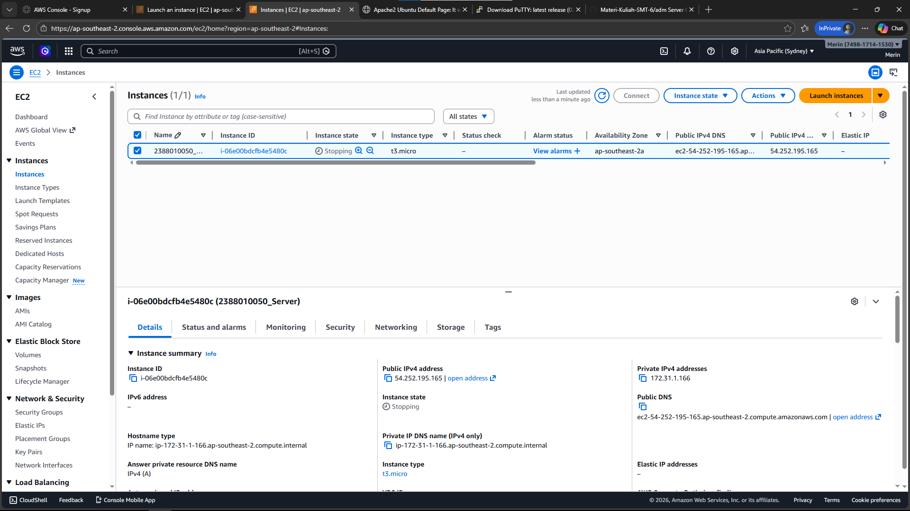

# Remote Instance with SSH putty
 1. Pastikan sudah install putty

 2. Konversi file Public Key dari .pem menjadi .ppk di putty
 - buka puttyGen
 - load File .pem
 - Save as .ppk
 

 3. Set Up Putty untuk Remote SSH
- buka apps Putty
- Isi IP Public 
- Isi port untuk SSH sesuai Security Group di Instance
- Isi Nama session agar saat connect lagi tinggal load aja
- load file .ppk (Klik SSH -> Auth -> Credentials)

4. Sudo apt-get Update (Update OS) lanjut sudo apt-get Upgrade

5. Pembuktian Remote SSH secara visual
- Copy public IP Address instance paste ke Browser

-Install Web Server seperti Apache/Nginx
-sudo apt install apache2
-Reload Browser 

6. Matikan Instance agar tidak kena tagihan
- sudo shutdown now
