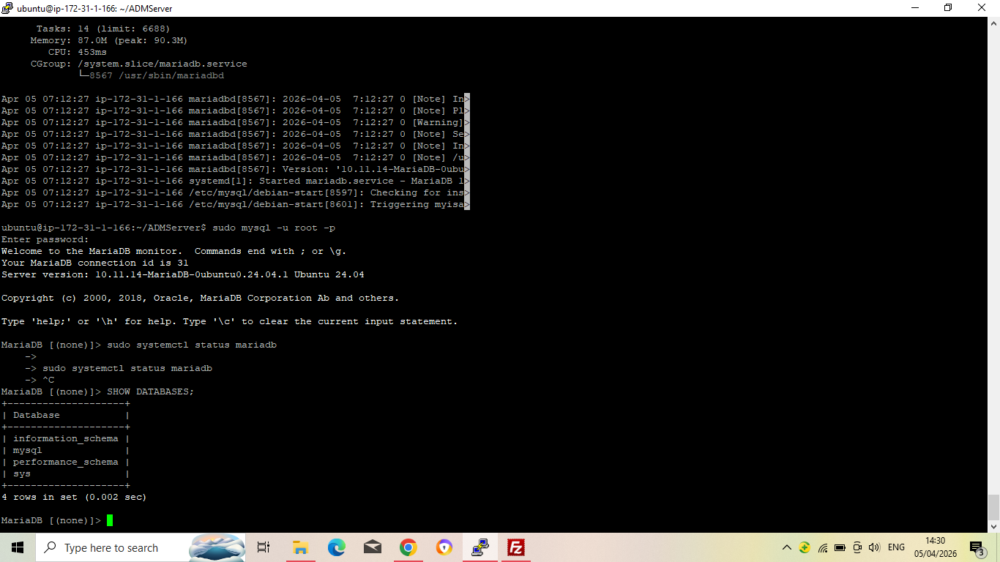
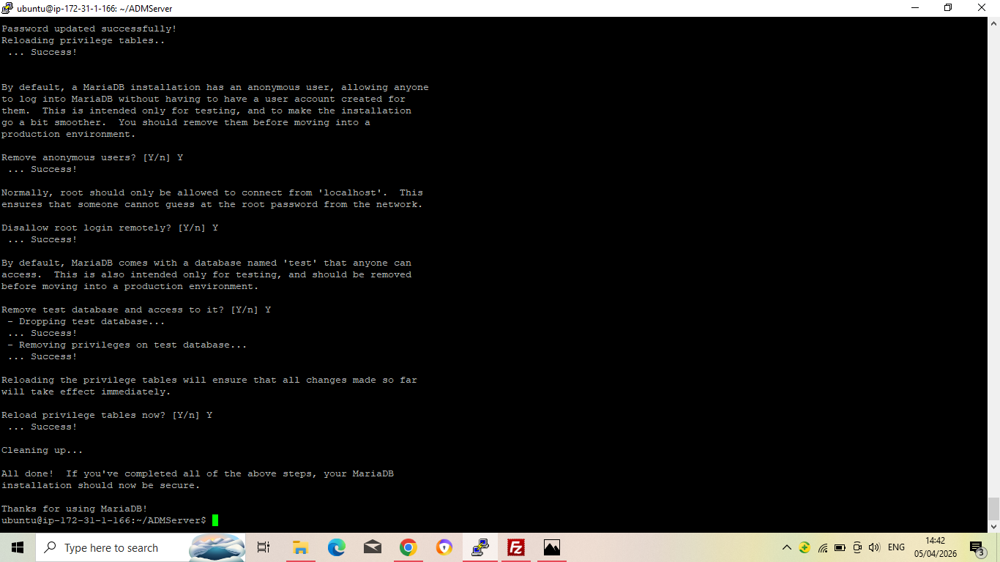
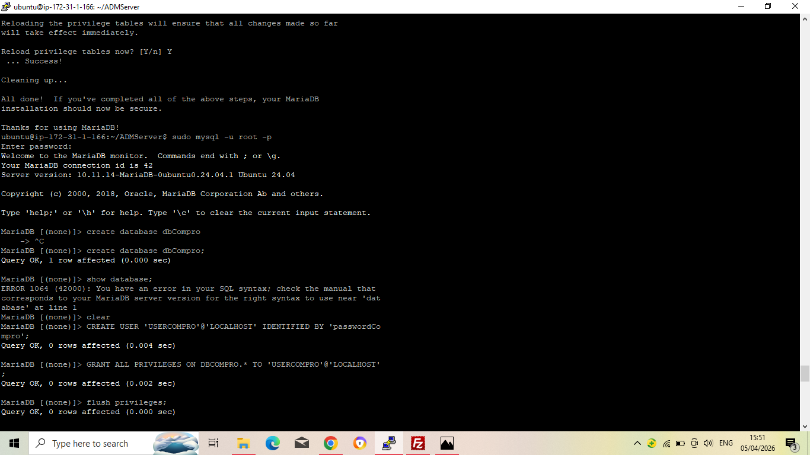
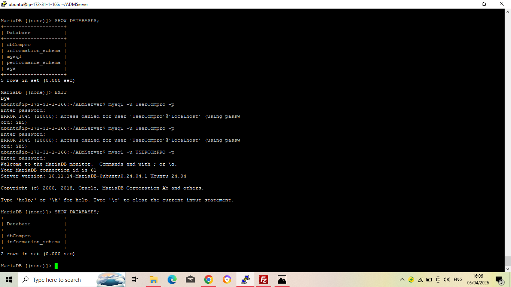

# membuat Database MySQL di AWS EC2

1. Aktifkan Instance di EC2
2. Remote SSH Via Terminal
    - Masuk ke folder penyimpanan Private Key
    - Masukkan command (ssh -i namafile.pem ubuntu @[IP_ADDRESS])
    - Tekan enter
3. Lakukan Patching OS
    - sudo apt-get update && sudo apt-get upgrade
4. Kita akan install MariaDb
    - sudo apt-get install mariadb-server
    - sudo systemctl status mariadb
    - Coba apakah default setting yg berlaku (sudo mysql -u root -p)
    - Cek apakah masih ada database dummy (show databases;)
    
5. Kita lakukan hardening security
    - Masukkan command (sudo mysql_secure_installation)
    - Masukkan password db aws sever: merinkp
    - Remove anonymous users (Y)
    - Dissallow root login remotely (Y)
    - Remove test database and access to it (Y)
    - Reload privilege tables now? (Y)
    
6. Membuat database dan user
    - Membuat database untuk web company profile (create database dbCompro)
    - Membuat user untuk web company profile (create user 'userCompro'@'localhost' identified by '***;)
    - Memberikan hak akses user untuk web company profile (grant all privileges on dbCompro. * to 'userCompro'@'localhost';)
    - Flush Privilege (flush privileges;)
    - Keluar dari MySQL (exit;)
    
7. Login sebagai user baru
    - Masukkan command (mysql -u userCompro -p)
    - Masukkan password (***)
    - Cek apakah password
    