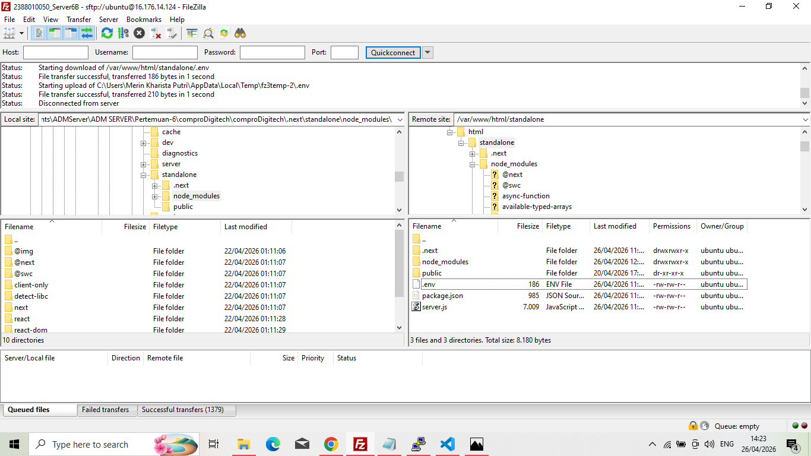
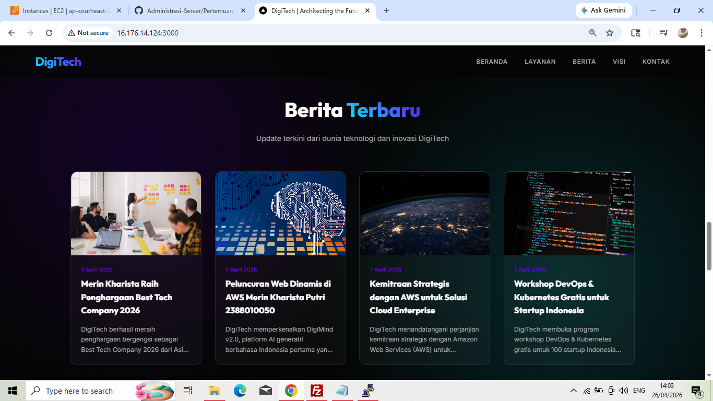

# Melakukan Uploading Web Apps Dynamic ke EC2 AWS

1. Pastikan Web Apps Dynamic sudah berjalan tanpa error di Localhost
2. Jika sudah tabpa error kita akaan membuat folder build
    - npm ru build
    - Pastikan menghasilkan folder .next/standalone di dalam tersedia folder public dan di folder .next ada folder static
3. Proses upload file folder standalone
    - Lakukan Proses Archive pada folder .next/standalone dan folder public .zip
    - Running instance -> connect open SSH -> connect FileZilla
    - Upload file hasil archive ke EC2 AWS menggunakan filezilla
    
    - ekstrak file hasil archive di EC2 AWS
        a. Install tools unzip di ec2 AWS
            - sudo apt install unzip -y
            - cd /var/www/html
            - ls
        b. Ekstract file hasil archive
            - unzip nama_file.zip
4. Export dbcompro dari localhost ke sql
    - login ke SQL
    - use dbCompro;
    - copy paste query sql dari localhost (Engine dihapus)
    - cek apakah tabel sudah terisi
        - select * from berita;
        - select * from users;
5. Sesuaikan isi file .env
DB_HOST=localhost
DB_USER=USERCOMPRO
DB_PASSWORD=passwordCompro
DB_NAME=dbCompro
DB_PORT=3306

NEXTAUTH_SECRET=ganti-dengan-string-acak-panjang-minimal-32-karakter
NEXTAUTH_URL=http://16.176.14.124:3000/
6. Di termiinal ssh cd ke folderstandalone run apps -pm2 start server.js -pm2 save -pm2 startup
7. Buka port 3000 di securitygroup ec2 aws

    - edit inbound ruls -add rule

        - save
        - check perubahan -
