# UAS ADMINISTRASI SERVER MERIN KHARISTA PUTRI 2388010050

# WEB-STATIS
1. Buat Instance EC2 Baru dan Running
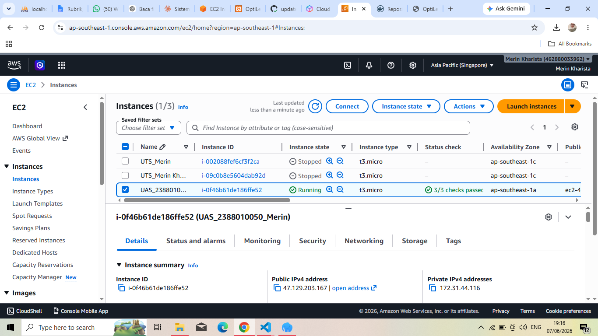
2. Buat Security Group
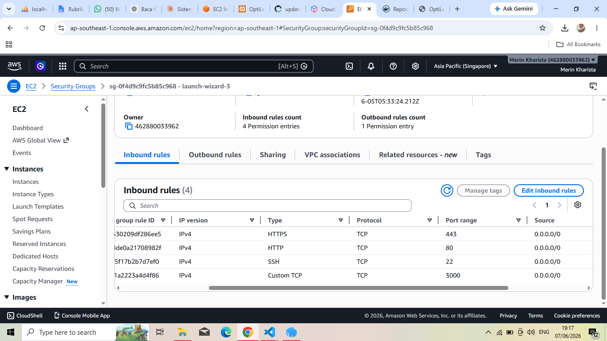
3. Patching OS
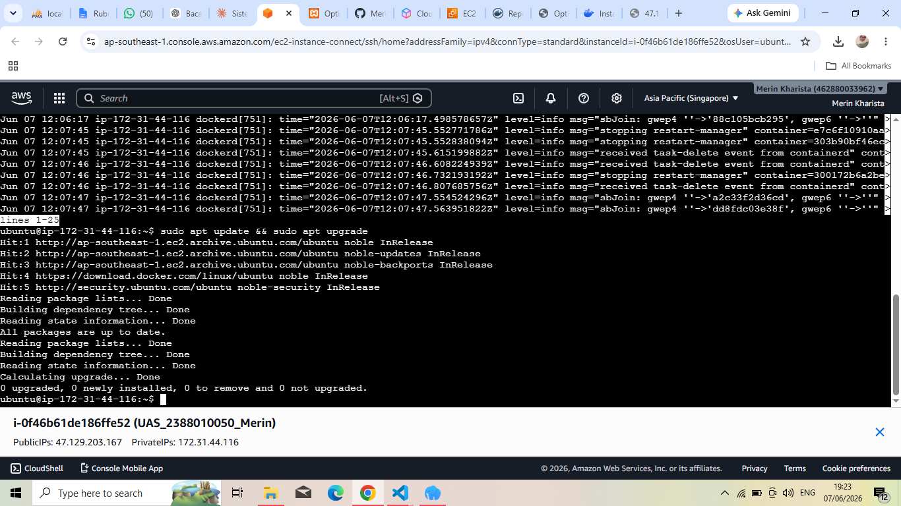
4. Buat Repository Baru di Github dan setting secret_key
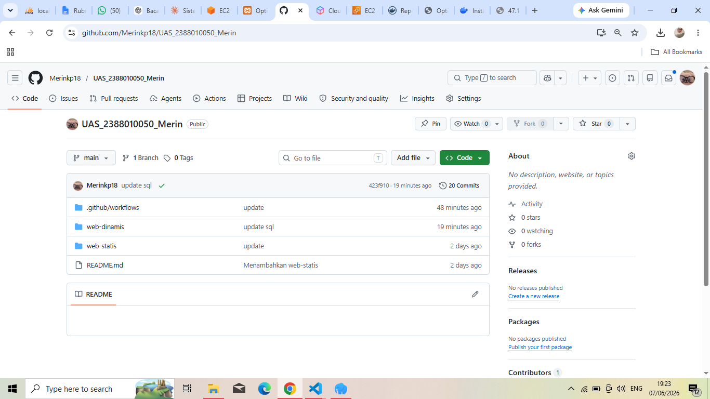
5. Install docker di terminal dan cek systemctl running
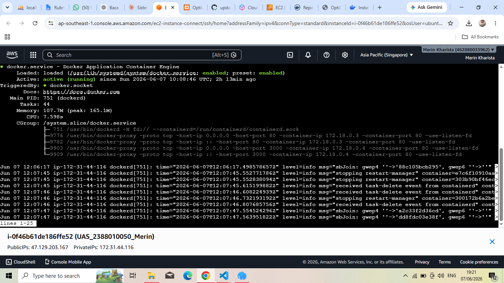
6. Buat Repo baru di Docker
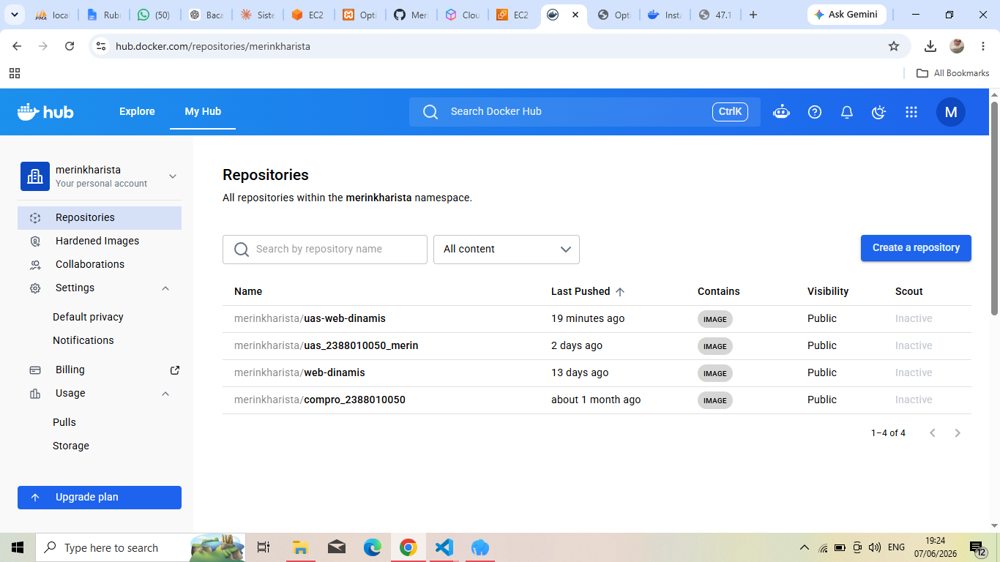
7. Buat Token di Docker
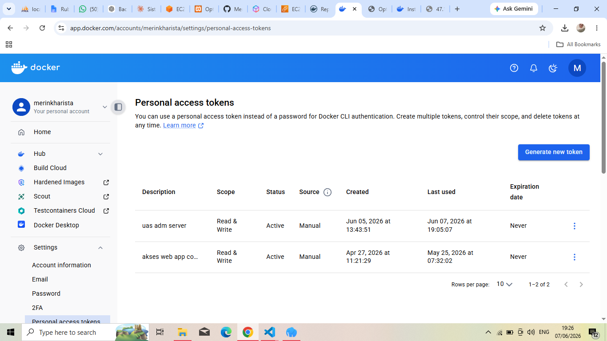
8. Buat secret_key di Github

9. Deploy web statis
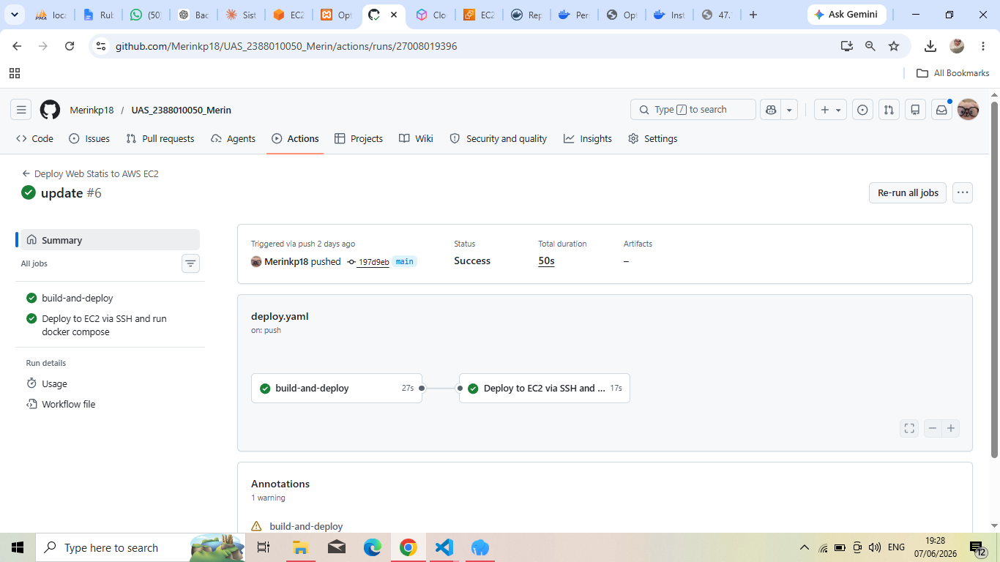
10. Tampil Web CV Statis
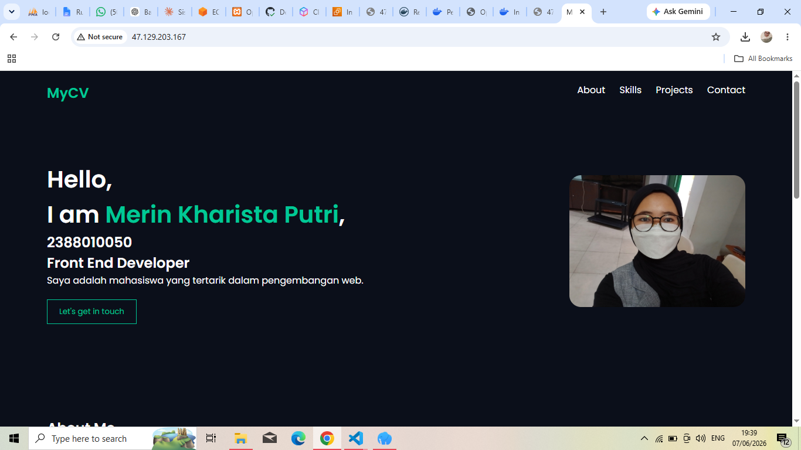

# WEB-DINAMIS (PHP)
1. Buat db baru 'db_uas' dan buat user account baru 'uas_merin' beri privelleage untuk db 'db_uas'
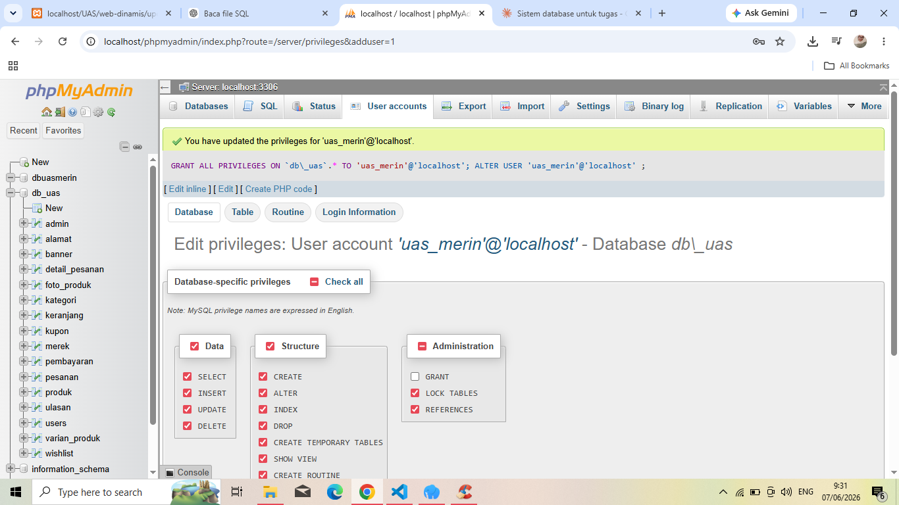
2. Buat repo docker untuk web dinamis

3. Buat website 
    - Buat Dockerfile yg menyesuaikan dengan bahasa dipakai (php)
    - Buat juga file docker-compose.yml di dalam folder web-dinamis
    - Buat deploy-web-dinamis.yml
4. Deploy web-dinamis
    - Deploy di Github
    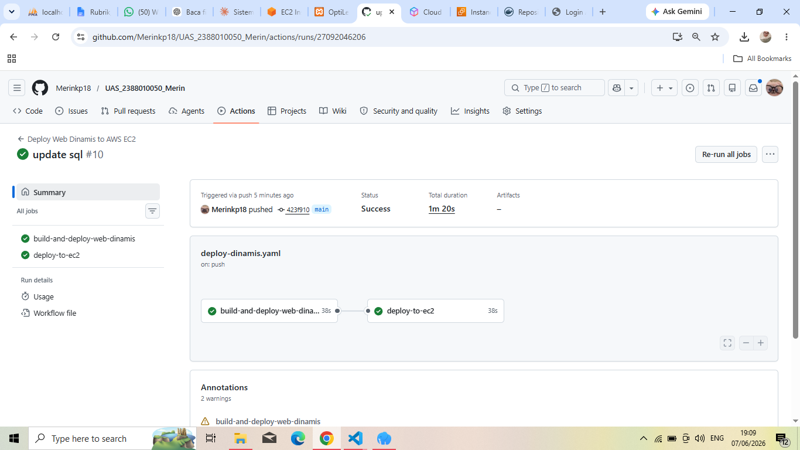
    - Halaman utama
    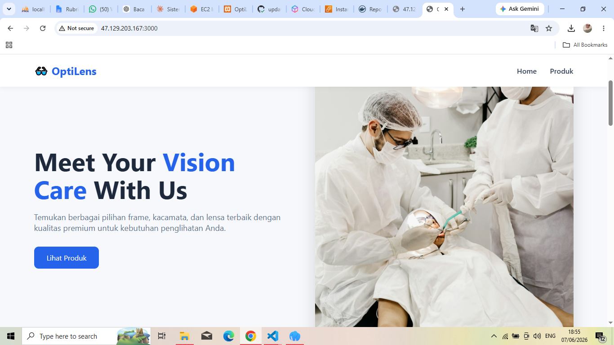
    - Login
    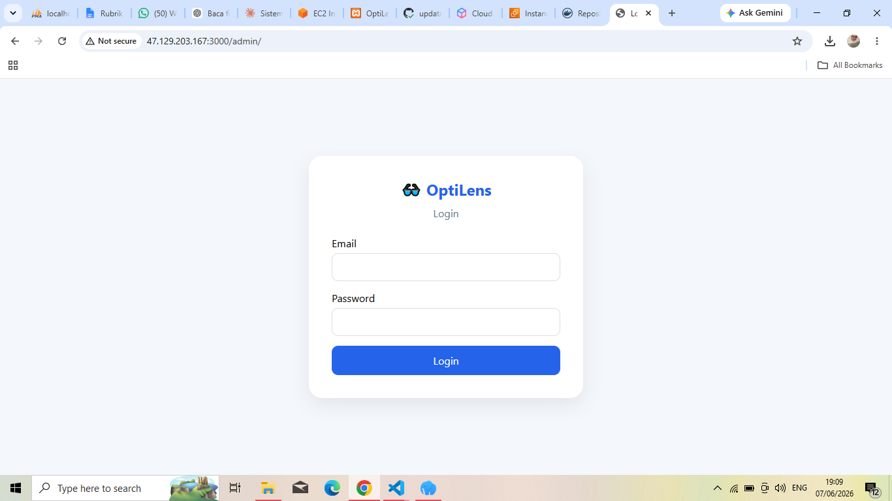
    - Dashboard
    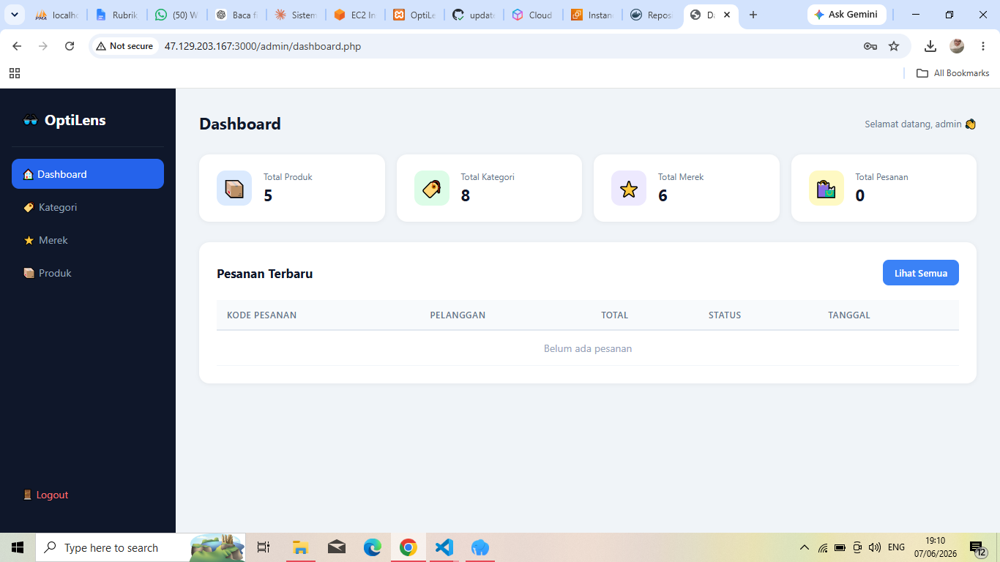