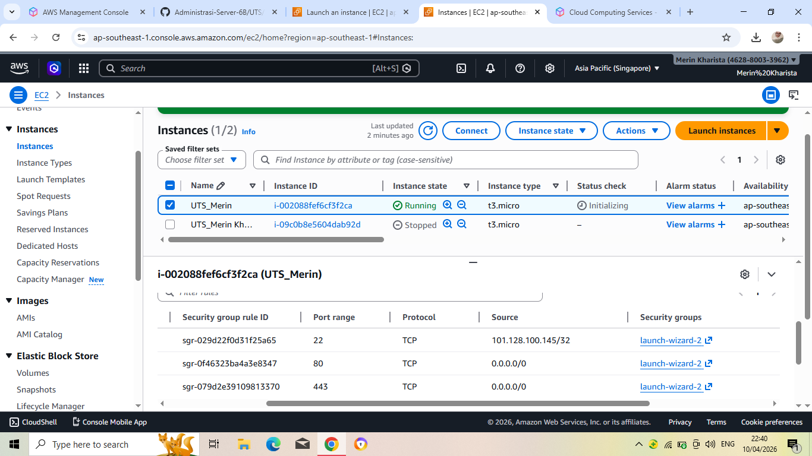
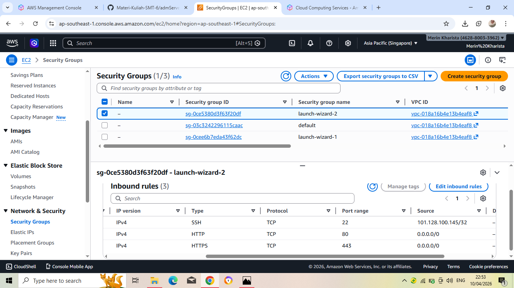
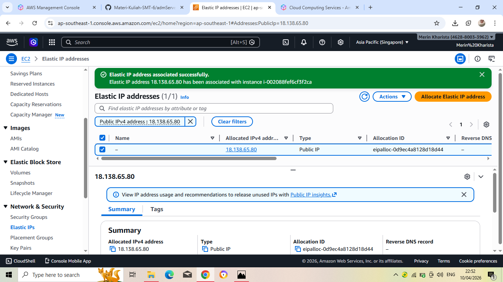
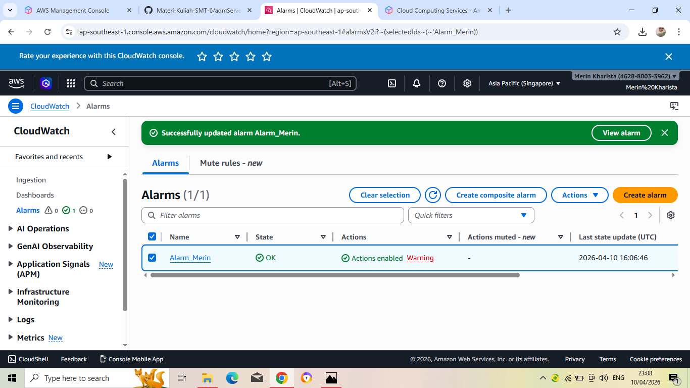
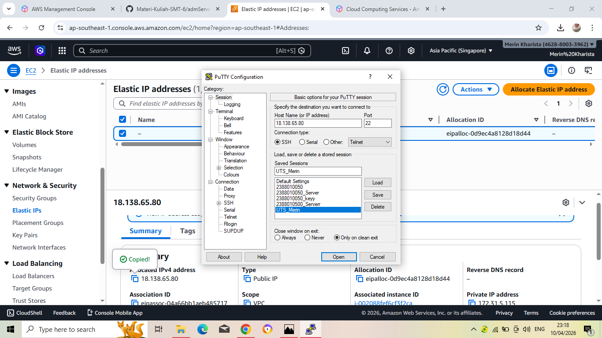
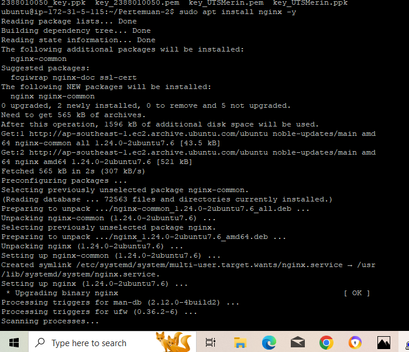
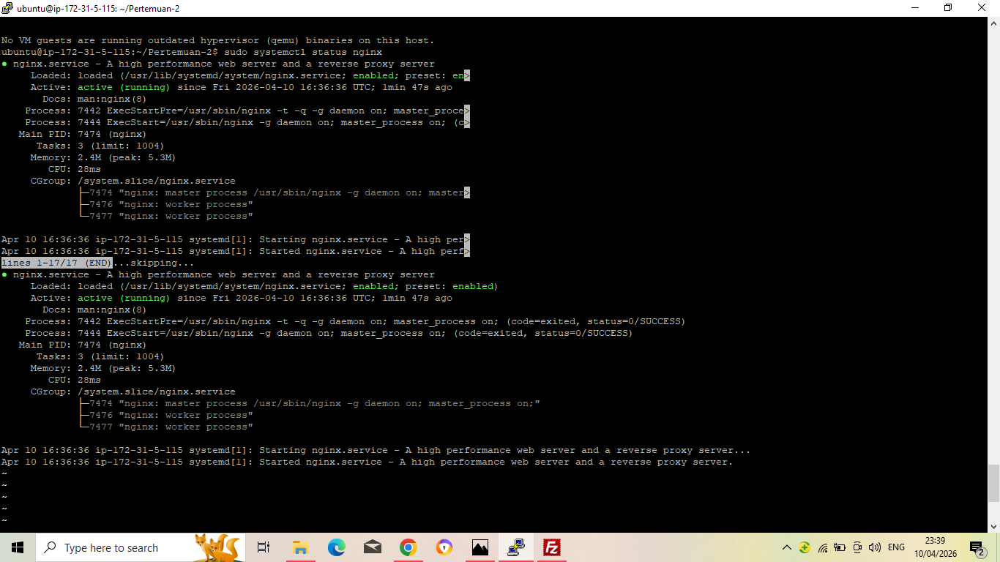
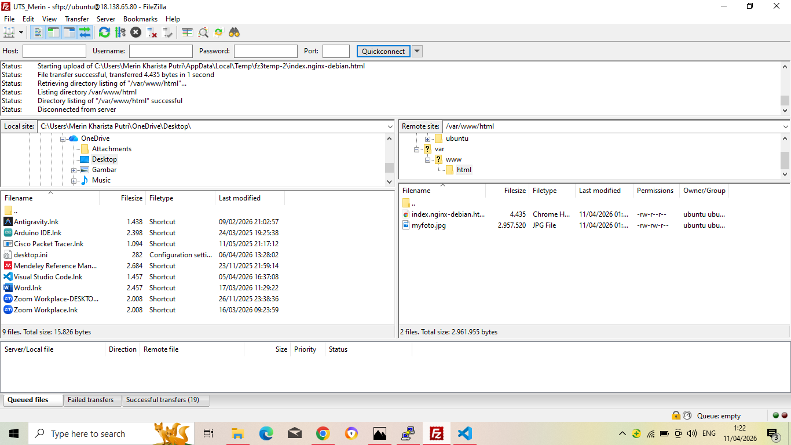
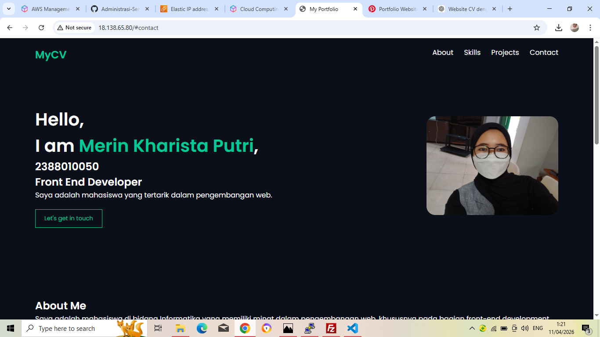

# UTS-Membuat Website CV

# Elastic IP 18.138.65.80
Merin Kharista Putri - 238010050

1. Membuat instance EC2

2. Setting Security Group Inbound Rules

3. Membuat elastic IP

4. Membuat alarm di cloudwatch untuk monitoring CPU

5. Remote SSH menggunakan Putty

6. Installasi web server Nginx
   

7. Status Nginx berhasil active (running)

8. Memindahkan source code web cv ke server

9. Menjalankan IP untuk melihat web cv

